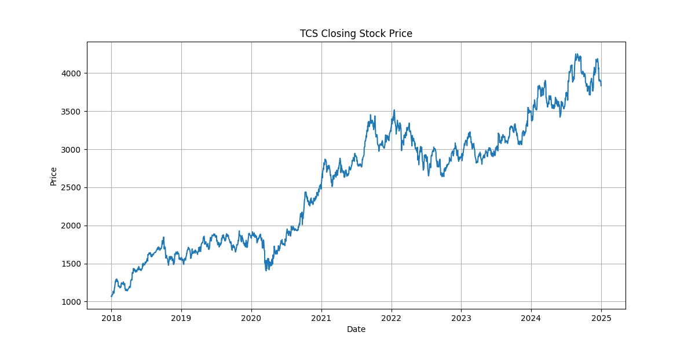
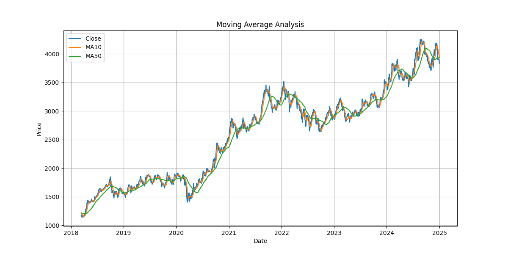
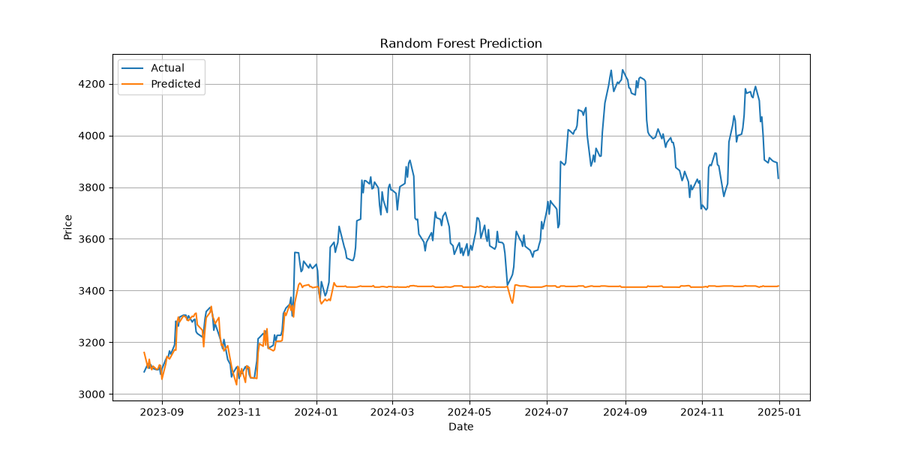
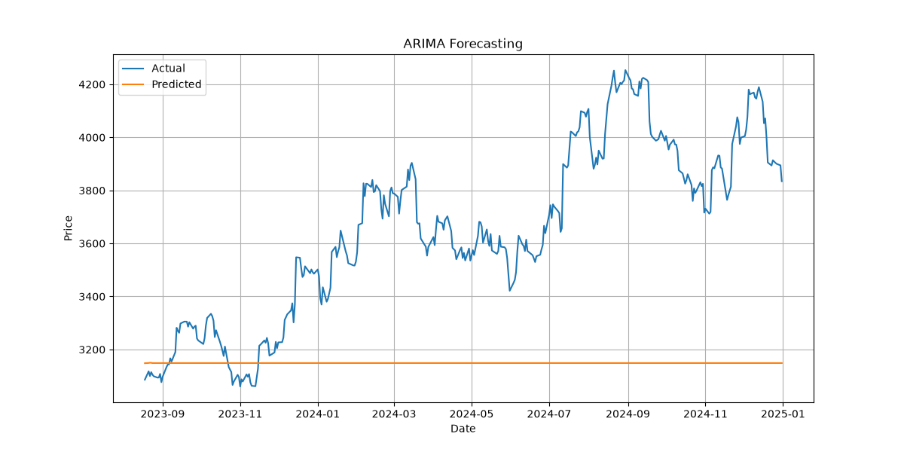
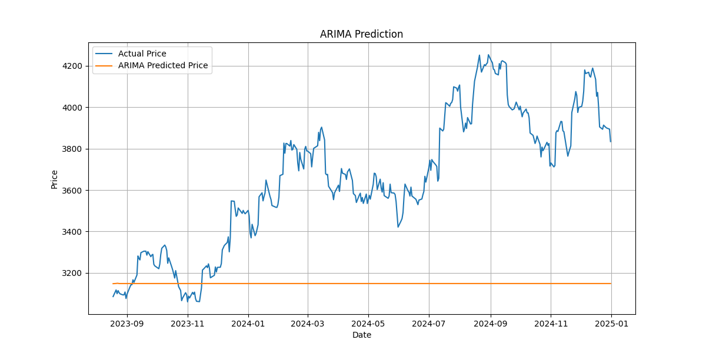
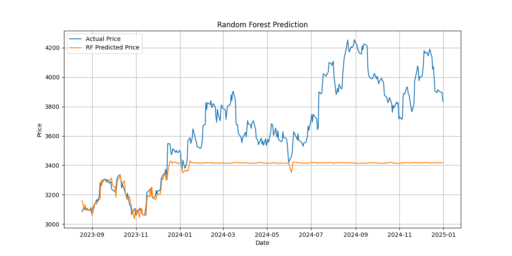
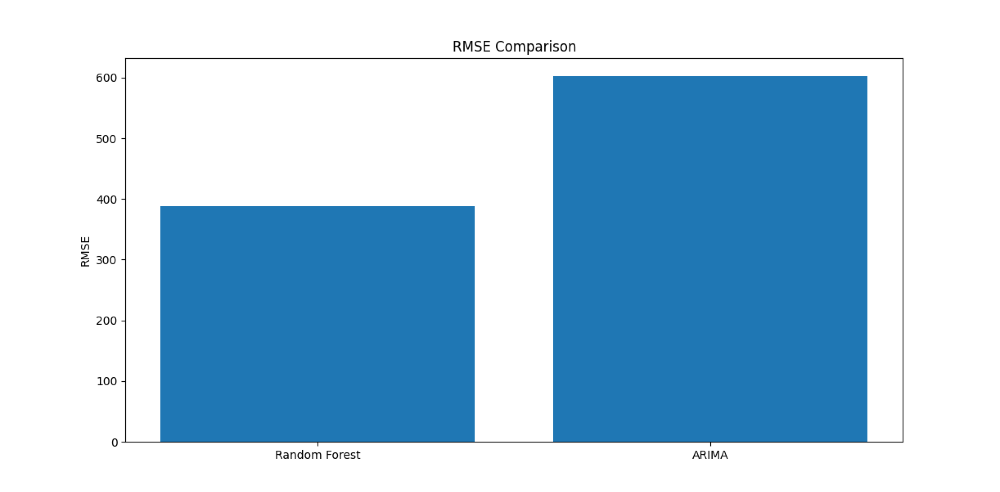

#  Stock Market Prediction using Time Series Analysis

## Overview

This project presents a comprehensive analysis and forecasting framework for Tata Consultancy Services (TCS) stock prices using historical market data obtained from Yahoo Finance.

The objective of this study is to analyze stock price behavior, extract meaningful features, and compare the forecasting capabilities of traditional time series models and machine learning techniques.

The project implements:

- ARIMA (AutoRegressive Integrated Moving Average)
- Random Forest Regression

The performance of both models is evaluated using Mean Absolute Error (MAE) and Root Mean Squared Error (RMSE).

---

# Problem Statement

Stock markets are influenced by several factors and exhibit complex behavior characterized by trends, volatility, and random fluctuations. Accurate prediction of stock prices is a challenging task.

This project investigates whether historical price patterns can be utilized to forecast future stock movements and compares the effectiveness of statistical and machine learning approaches.

---

# Dataset

### Source

Yahoo Finance

### Stock Symbol

TCS.NS

### Time Period

2018 – 2025

### Variables

- Open Price
- High Price
- Low Price
- Closing Price
- Trading Volume

---

# Feature Engineering

Several derived variables were generated to improve forecasting performance.

### Moving Average (MA10)

Captures short-term trends in stock prices.

### Moving Average (MA50)

Represents long-term market behavior.

### Volatility

Measures fluctuations and risk associated with stock prices.

### Lag Variables

- Lag1
- Lag2
- Lag3

These variables represent previous closing prices and help models capture temporal dependencies.

---

# Methodology

The project follows the following workflow:

1. Data Collection
2. Data Cleaning
3. Feature Engineering
4. Exploratory Data Analysis
5. ARIMA Model Development
6. Random Forest Regression Model
7. Model Evaluation
8. Visualization and Interpretation

---

# Technologies Used

- Python
- Pandas
- NumPy
- Matplotlib
- Seaborn
- Scikit-Learn
- Statsmodels
- yfinance
- Tkinter

---

# Dashboard

The project includes a desktop dashboard built using Tkinter. The dashboard consists of six sections:

- Overview
- Statistical Analysis
- Feature Engineering
- Random Forest Prediction
- ARIMA Forecasting
- Model Comparison

---

# Stock Price Trend

The following graph illustrates the overall movement of TCS stock closing prices from 2018 to 2025.

---

# Moving Average Analysis

Moving averages are used to smooth short-term fluctuations and reveal long-term trends.

- MA10 captures short-term behavior.
- MA50 captures long-term behavior.

---

# Random Forest Prediction

Random Forest Regression was implemented using engineered features such as moving averages, volatility indicators, and lag variables.

The model captures nonlinear relationships present in stock prices and attempts to predict future closing prices.

---

# ARIMA Forecasting

ARIMA is a classical time series forecasting model that utilizes previous observations and historical patterns to estimate future stock prices.

---

# Alternative ARIMA Visualization

The following graph shows another ARIMA prediction obtained during experimentation.

---

# Alternative Random Forest Visualization

Another Random Forest output obtained during model development is shown below.

---

# Exploratory Data Analysis

The project also includes:

### Histogram of Closing Prices

To study the frequency distribution of stock prices.

### Daily Return Distribution

To understand return patterns.

### Box Plot

To detect outliers and analyze dispersion.

### Pie Chart

To compare gain days and loss days.

### Correlation Heatmap

To study relationships among engineered features.

---

# Evaluation Metrics

Two performance metrics were used to evaluate forecasting accuracy.

### Mean Absolute Error (MAE)

Measures the average prediction error.

Lower values indicate better performance.

### Root Mean Squared Error (RMSE)

Penalizes larger prediction errors more heavily.

Lower RMSE values indicate superior model performance.
### EVALUATION OF METHODS 
Random Forest
MAE : 298.7039672270276
RMSE: 388.688755024486
ARIMA
MAE : 514.7121289536742
RMSE: 602.0709505749367

RANDOM FOREST VS ARIMA

---

# Key Findings

- Historical stock prices contain useful information for forecasting future values.
- Feature engineering significantly improves model performance.
- ARIMA effectively captures temporal dependencies and long-term trends.
- Random Forest Regression handles nonlinear patterns and market fluctuations more effectively.
- Combining statistical methods with machine learning provides deeper insights into stock behavior.

---

# Conclusion

This project demonstrates the application of Time Series Analysis and Machine Learning techniques to stock market forecasting.

The comparison between ARIMA and Random Forest highlights the strengths of both approaches. While ARIMA provides a robust framework for modeling sequential dependencies, Random Forest offers flexibility in capturing complex nonlinear relationships.

The study emphasizes the importance of feature engineering and exploratory analysis in developing effective predictive models for financial time series.

---

# Future Scope

- LSTM-based Deep Learning Models
- Real-Time Stock Prediction
- Multi-stock Portfolio Analysis
- Web-based Interactive Dashboard
- Sentiment Analysis using News Data

---

## Author

**Somya Y**

M.Sc. Applied Data Science

SRM Institute of Science and Technology
